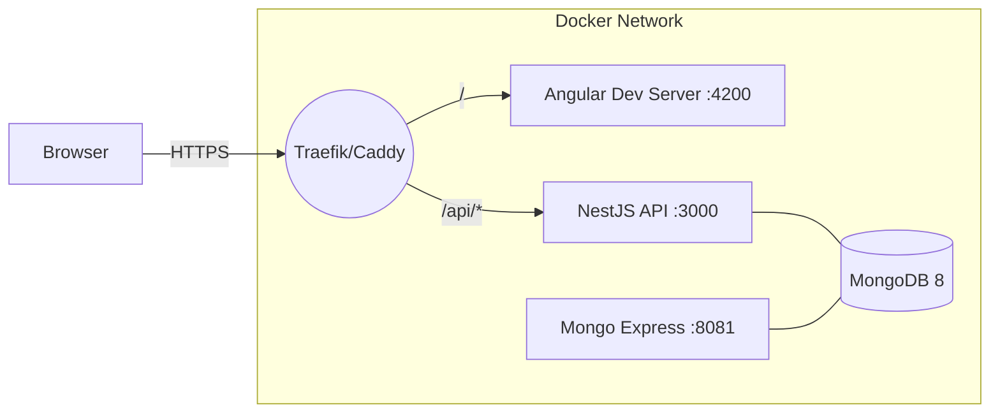

# MRV App (Angular 20 + NestJS + MongoDB 8)

A modern, production-grade **MRV** (Measurement, Reporting & Verification) web application for GHG emissions.

- **Frontend**: Angular **20.1.7** (CLI **20.1.6**), TypeScript **5.8.3**, Zone.js **0.15.x**
- **API**: NestJS **10**, Mongoose **8** (MongoDB **8**)
- **Dev Experience**: Docker-first, local HTTPS (Traefik or Caddy), pinned Node engines
- **Auth**: JWT access token + httpOnly refresh cookie (Secure in HTTPS)

> For development details and troubleshooting, see **[docs/DEV.md](docs/DEV.md)**.  
> For contribution standards and workflows, see **[CONTRIBUTING.md](CONTRIBUTING.md)**.

---

## Quick Start (Dev, HTTP)

```bash
docker compose down -v
docker compose up -d web api mongo mongo-express
docker compose logs -f web
```

- Web: http://localhost:4200  
- API: http://localhost:3000/healthz  
- Mongo Express: http://localhost:8081

---

## Quick Start (Dev, HTTPS via Traefik) — Recommended

1) Generate a trusted localhost cert (with `mkcert`).  
2) Start with the HTTPS override:

```bash
docker compose -f docker-compose.yml -f docker-compose.https.yml --profile traefik up -d traefik web api
# App: https://localhost
# Traefik dashboard: http://localhost:8080
```

> Alternative local HTTPS with **Caddy** is also supported (see `Caddyfile`).

---

## Default Admin (Dev)

Seeded on first API start (override in `.env`):

- Email: `admin@example.com`  
- Password: `ChangeMe123`

---

## Architecture (dev env)



**Notes**
- `/` → Angular dev server (supports HMR/WebSockets)
- `/api` → NestJS API; refresh cookie is `httpOnly`, `SameSite=Lax`, `Secure` in HTTPS

---

## Project Layout (top-level)
```
dev-env/
├─ apps/
│  ├─ web/      # Angular 20 (standalone components)
│  └─ api/      # NestJS 10 API (auth, users, health)
├─ docker-compose.yml
├─ docker-compose.https.yml   # Traefik profile
├─ Caddyfile                  # Optional local HTTPS via Caddy
├─ traefik/                   # Traefik config
├─ certs/                     # mkcert output (localhost.pem/key)
├─ .env                       # CORS_ORIGIN, COOKIE_SECURE, ADMIN_* etc.
├─ .nvmrc                     # 20.19.0
└─ .npmrc                     # engine-strict=true
```

---

## Security Defaults

- Helmet enabled on API
- CORS narrowed to `CORS_ORIGIN` (e.g., `https://localhost`)
- Refresh cookie: `httpOnly`, `Secure` (in HTTPS), `SameSite=Lax`

---

## License

© Your Organization — All rights reserved.
