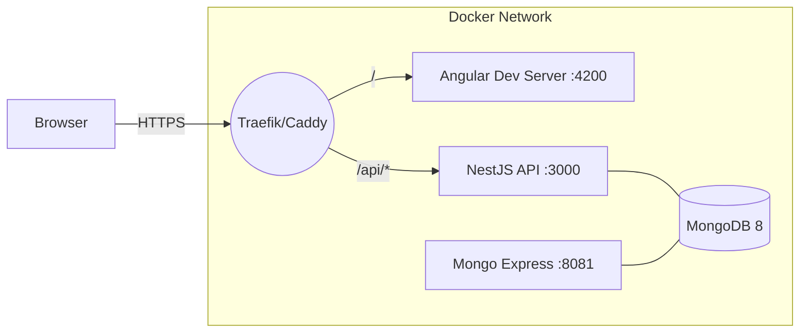

# MRV App

A modern, production-grade **MRV** (Measurement, Reporting & Verification) web application for GHG emissions.

- **Frontend**: Angular **20.1.7** (CLI **20.1.6**), TypeScript **5.8.3**, Zone.js **0.15.x**
- **API**: NestJS **10**, Mongoose **8** (MongoDB **8**)
- **Dev Experience**: Docker-first, local HTTPS (Traefik or Caddy), pinned Node engines
- **Auth**: JWT access token + httpOnly refresh cookie (Secure in HTTPS)

> For development details and troubleshooting, see **[docs/DEV.md](docs/DEV.md)**.  
> For contribution standards and workflows, see **[CONTRIBUTING.md](CONTRIBUTING.md)**.

---

## Quick Start (Dev, HTTP)

```bash
docker compose down -v
docker compose up -d web api mongo mongo-express
docker compose logs -f web
```

- Web: http://localhost:4200  
- API: http://localhost:3000/healthz  
- Mongo Express: http://localhost:8081

---

## Quick Start (Dev, HTTPS via Traefik) — Recommended

1) Generate a trusted localhost cert (see **Trusted localhost certs** below).  
2) Start with the HTTPS override:

```bash
docker compose -f docker-compose.yml -f docker-compose.https.yml --profile traefik up -d traefik web api
# App: https://localhost
# Traefik dashboard: http://localhost:8080
```

> Alternative local HTTPS with **Caddy** is also supported (see `Caddyfile`).

---

## Default Admin (Dev)

Seeded on first API start (override in `.env`):

- Email: `admin@example.com`  
- Password: `ChangeMe123`

---

## Architecture (dev env)



**Notes**
- `/` → Angular dev server (supports HMR/WebSockets)
- `/api` → NestJS API; refresh cookie is `httpOnly`, `SameSite=Lax`, `Secure` in HTTPS

---

## System Functional Flow

```mermaid
flowchart LR
  user([Analyst / Admin User]) -->|HTTPS| web[Web App (Angular 20)]

  subgraph API["API (NestJS 10)"]
    auth[Auth & RBAC<br/>JWT Access + Refresh Cookie<br/>Guards/Decorators]
    users[User Admin<br/>Create/Disable/Reset<br/>Roles]
    catalog[Factor Catalog<br/>Factors/Units/Sources<br/>Versioning & Traceability]
    ingest[Activity Ingestion<br/>Upload/Validate/Map<br/>Job Status & Errors]
    calc[Calculation Engine<br/>Scope 1/2/3<br/>CO₂e & Uncertainty<br/>Recompute Strategy]
    report[Inventory & Reporting<br/>Org/Project/Asset<br/>Period Reports & Exports]
    audit[Audit Log<br/>Inputs/Outputs/Actor<br/>Reproducibility]
  end

  subgraph DataStores["Data Stores"]
    mongo[(MongoDB 8<br/>Users/Factors/Activity/Results/Audit)]
    obj[(Object Storage<br/>MinIO/S3: Uploads & Exports)]
  end

  web -->|/auth/login /refresh /me| auth
  auth --> users
  auth --> catalog
  auth --> ingest
  auth --> calc
  auth --> report

  catalog <-->|CRUD| mongo
  web -->|Presigned upload| ingest
  ingest --> obj
  ingest --> mongo

  calc --> mongo
  calc --> audit
  audit --> mongo

  report --> mongo
  report --> obj
  report --> web

  users -->|Invites/Resets| smtp[SMTP (Mailhog/SES)]

  web -.-> cdn[CDN (CloudFront) - prod]
  auth -.-> ecs[ECS Fargate/ALB - prod]
```

---

## Data Pipeline Flow (Ingestion → Validation → Calculation → Reporting)

```mermaid
flowchart LR
  user([Analyst]) --> web[Web App (Angular)]

  subgraph Storage
    obj[(Object Storage<br/>MinIO/S3)]
    mongo[(MongoDB 8)]
  end

  subgraph Ingestion["Ingestion Service"]
    up[Upload File<br/>CSV/XLSX/API] --> val[Validate Schema<br/>Types/Units/Ranges]
    val --> map[Map Fields<br/>Templates/Profiles]
    map --> store1[Store Valid Rows]
    map --> err[Collect Errors<br/>Row-level CSV]
  end

  web -->|Presigned PUT| obj
  up --> obj
  store1 --> mongo
  err --> obj

  subgraph Engine["Calculation Engine"]
    pick[Resolve Factors<br/>Versioned Catalog] --> compute[Compute CO₂e<br/>Scope 1/2/3<br/>Uncertainty] --> audit[Write Audit Trail]
  end

  mongo --> pick
  compute --> res[Results -> Mongo]

  subgraph Reporting["Inventory & Reporting"]
    inv[Inventory Views<br/>Org/Project/Asset]
    exp[Exports<br/>CSV/XLSX/PDF]
  end

  res --> inv
  inv --> web
  exp --> obj
  web -->|Download| obj
```

---

## Project Layout (top-level)
```
dev-env/
├─ apps/
│  ├─ web/      # Angular 20 (standalone components)
│  └─ api/      # NestJS 10 API (auth, users, health)
├─ docker-compose.yml
├─ docker-compose.https.yml   # Traefik profile
├─ Caddyfile                  # Optional local HTTPS via Caddy
├─ traefik/                   # Traefik config
├─ certs/                     # mkcert output (localhost.pem/key)
├─ .env                       # CORS_ORIGIN, COOKIE_SECURE, ADMIN_* etc.
├─ .nvmrc                     # 20.19.0
└─ .npmrc                     # engine-strict=true
```

---

## Security Defaults

- Helmet enabled on API
- CORS narrowed to `CORS_ORIGIN` (e.g., `https://localhost`)
- Refresh cookie: `httpOnly`, `Secure` (in HTTPS), `SameSite=Lax`

---

## Trusted localhost certs (macOS & Windows)

> Run these on your **host OS**, not inside Docker. The certs will be saved in `./certs` and mounted into the proxy (Traefik/Caddy) or Angular dev server.

### macOS (with Homebrew)

1) Install mkcert (and NSS for Firefox trust):
```bash
brew install mkcert nss
```

2) Install the local CA (you’ll get a Keychain prompt):
```bash
mkcert -install
```

3) Generate certs for localhost (PEM + KEY in `./certs`):
```bash
mkdir -p certs
mkcert -cert-file ./certs/localhost.pem -key-file ./certs/localhost-key.pem "localhost" 127.0.0.1 ::1
```

**Optional – custom hostname (e.g., `mrv.localhost`):**
```bash
sudo sh -c 'echo "127.0.0.1 mrv.localhost" >> /etc/hosts'
mkcert -cert-file ./certs/localhost.pem -key-file ./certs/localhost-key.pem "localhost" "mrv.localhost" 127.0.0.1 ::1
```

**Verify trust (optional):**
- Open **Keychain Access** → “login” → **Certificates** → look for **“mkcert development CA”**.

---

### Windows 10/11

1) Install mkcert:

**Chocolatey**
```powershell
choco install mkcert -y
choco install nss -y   # optional, enables Firefox trust
```

**Scoop**
```powershell
scoop install mkcert
```

2) Install the local CA (accept the UAC prompt):
```powershell
mkcert -install
```

3) Generate certs for localhost (PEM + KEY in `.\certs`):
```powershell
mkdir certs -ea 0 | Out-Null
mkcert -cert-file .\certs\localhost.pem -key-file .\certs\localhost-key.pem "localhost" 127.0.0.1 ::1
```

**Optional – custom hostname (e.g., `mrv.localhost`):**
```powershell
notepad C:\Windows\System32\drivers\etc\hosts   # add: 127.0.0.1  mrv.localhost
mkcert -cert-file .\certs\localhost.pem -key-file .\certs\localhost-key.pem "localhost" "mrv.localhost" 127.0.0.1 ::1
```

**Verify trust (optional):**
- Run `certmgr.msc` → **Current User** → **Trusted Root Certification Authorities** → **Certificates** → look for **“mkcert development CA”**.

---

### Wiring the certs into the stack

**Caddy**:
```caddyfile
https://localhost {
  tls /certs/localhost.pem /certs/localhost-key.pem
  # ...
}
```
Docker Compose volume:
```yaml
- ./certs:/certs:ro
```

**Traefik** (`traefik/dynamic.yml`):
```yaml
tls:
  certificates:
    - certFile: /certs/localhost.pem
      keyFile: /certs/localhost-key.pem
```
Docker Compose volume:
```yaml
- ./certs:/certs:ro
```

**Angular dev server (optional direct HTTPS)**:
```bash
ng serve --ssl true --ssl-cert ./certs/localhost.pem --ssl-key ./certs/localhost-key.pem --port 4443
```

---

### Sanity checks

Where mkcert stores its CA:
```bash
mkcert -CAROOT
```

Verify cert SANs:
```bash
openssl x509 -in ./certs/localhost.pem -noout -text | grep -A1 "Subject Alternative Name"
```

Curl without self-signed warnings:
```bash
curl -sv https://localhost 2>&1 | grep -i "issuer\\|subject\\|SSL connection"
```

---

### Common gotchas

- **Corporate device / strict policies**: CA install may be blocked by IT policy. Certs will generate, but won’t be trusted until the CA is approved.
- **Firefox not trusting certs**: install **nss** (macOS: `brew install nss`, Windows: `choco install nss`) before `mkcert -install`.
- **Changed hostnames**: regenerate certs if you add/remove hostnames:
  ```bash
  rm ./certs/localhost*.pem
  mkcert -cert-file ./certs/localhost.pem -key-file ./certs/localhost-key.pem "localhost" 127.0.0.1 ::1
  ```
- **Ports don’t matter**: certs only care about names/addresses, not ports.

---

## License

© Your Organization — All rights reserved.
